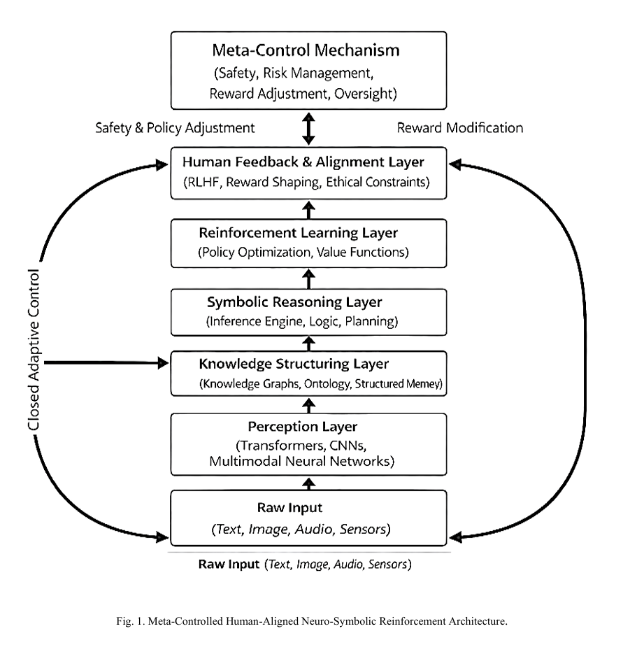

# Meta-Controlled Human-Aligned Neuro-Symbolic Reinforcement Architecture Toward AGI

This repository contains our IEEE-formatted research paper submitted for TechXter 15.0.

## 📄 Overview

This work proposes a hybrid AGI framework integrating:

- Deep Learning for perception  
- Knowledge Graphs for structured memory  
- Symbolic Reasoning for logical inference  
- Reinforcement Learning for adaptive decision-making  
- Human Feedback Alignment (RLHF)  
- Meta-Control supervisory mechanism for safety governance  

The architecture aims to provide a scalable and human-aligned pathway toward Artificial General Intelligence (AGI).

## 🧱 Proposed Architecture

## 👥 Team Members

- Mayuri Gade  
- Pranjali Deshmukh
- Nishank Khadpe 

## 📌 Event

Submitted for TechXter 15.0 Paper Presentation Competition.

## 🔑 Keywords

AGI, Neuro-Symbolic AI, Reinforcement Learning, Human Alignment, Meta-Control Mechanism

